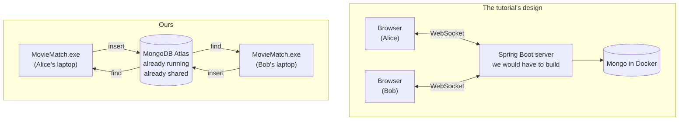
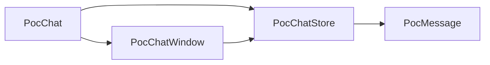
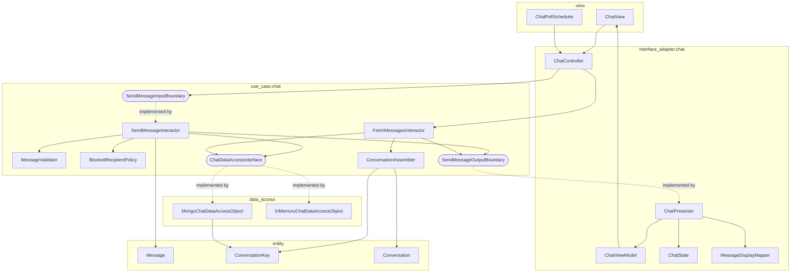
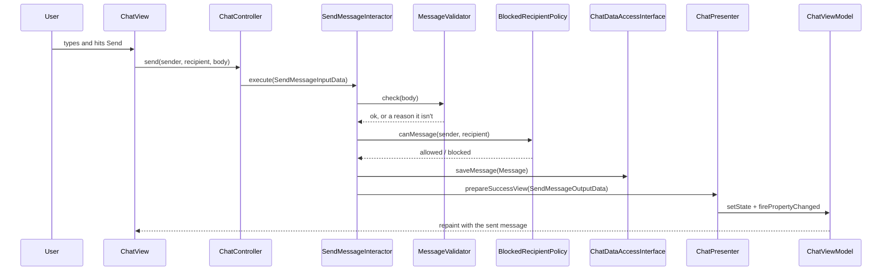
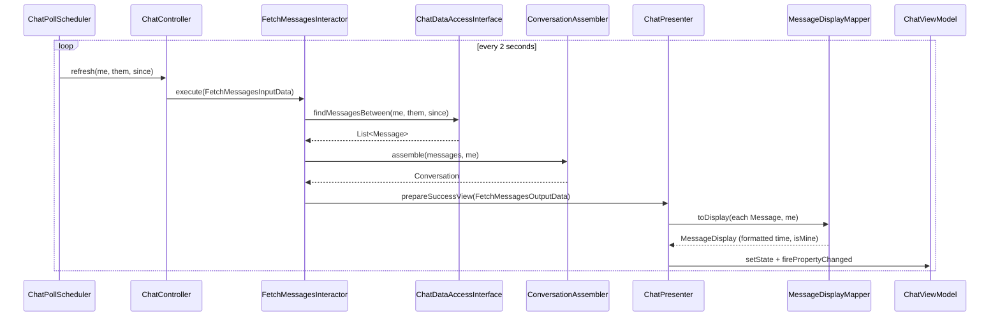

# One-on-one chat: proof of concept and build plan

**Branch:** `poc-chat-enzo` (never merges — it exists to answer a question and then be deleted)
**Author:** Enzo, for Kiersten
**Status:** proof of concept verified against live Atlas

---

## The short version

We do **not** need Spring Boot, we do **not** need Docker, and we do **not** need a
WebSocket server. MongoDB Atlas is already a server that every copy of MovieMatch is
already connected to, which makes it the message relay we were looking for. Chat becomes
an ordinary use case in the architecture we already have.

The proof of concept in `src/main/java/poc/chat/` demonstrates this. Two independent
connections — what two laptops actually look like — exchange messages through Atlas with
about 120 lines of database code.

---

## Why the tutorial doesn't transfer

The tutorial is [WebSocket Tutorial with Spring Boot](https://www.youtube.com/watch?v=7T-HnTE6v64)
by Ali Bouali. It's a good tutorial. It's for a different kind of program.

MovieMatch is a **desktop Swing application**. Each of us runs `app.Main` on our own laptop.
The tutorial builds a **web application**: a server process that browsers connect to. Almost
every piece of it is load-bearing for that shape and meaningless for ours.

Spring Boot isn't a library you add, it's the framework that owns application startup,
dependency wiring and an embedded web server. Adopting it means `AppBuilder` and `Main` get
replaced by Spring's container, and our Swing views get replaced by web pages. That is not a
feature, it's a rewrite of the entire project.

Spring Data MongoDB is a second, different way of talking to Mongo, layered on repository
interfaces. We already talk to Mongo directly through `mongodb-driver-sync` in
`MongoUserDataAccessObject`, and that works.

Docker in that tutorial exists for exactly one reason: to run a MongoDB instance on the
developer's own machine. We have Atlas. It's already running, it's already shared, and it's
already the thing our app connects to. There is nothing for Docker to do.

And the front end is HTML, CSS and JavaScript running in a browser. Kiersten's instinct here
was the correct one — that code cannot be converted into Java Swing, because it isn't a
translation problem. Browser UI and desktop UI are different programs.

**What survives from three hours of that tutorial:** roughly the shape of the message
document — who sent it, who receives it, the text, a timestamp. That's four fields, about
fifteen minutes of work. It is not worth finishing the tutorial to get them.

---

## The insight the tutorial hides

The worry was: *all the other tutorials were just between two devices, but we want any two
users online at the same time.*

That's the right thing to worry about, and it already has an answer.

A WebSocket is a connection between a client and a **server**. It exists to solve one
problem: two clients that have no shared storage need something in the middle to pass
messages through. In the tutorial, the Spring Boot app is that something.

We already have something in the middle. Every copy of MovieMatch, on every laptop,
connects to the same Atlas cluster. It doesn't matter whose machine it is or what network
they're on. Atlas is reachable from all of them, and it stores things.

So messages don't need to travel laptop to laptop. Alice's app writes a document; Bob's app
reads it.



The right-hand side has no component we need to build, deploy or learn. That's the whole
argument.

---

## Running the proof of concept

You need the `mongo.properties` you already use for the main app. Nothing else.

Run `poc.chat.PocChat` from IntelliJ (right-click the file, Run). It asks for your username
and who you're messaging.

**On one machine**, run it twice. In the first window answer `alice` then `bob`; in the
second answer `bob` then `alice`. Type in either window and watch it appear in the other.

**On two machines** — this is the run that actually proves the point — one window each, both
pointing at the same cluster. Kiersten runs it as herself messaging `enzo`, I run it as
`enzo` messaging her.

Messages go to a scratch collection called `poc_messages`, deliberately *not* `messages`, so
that throwing this branch away can't disturb the real feature. Run it with the argument
`clean` to empty that collection.

---

## What was verified

Eleven checks against the live Atlas cluster, using two separate `PocChatStore` instances
with their own `MongoClient` connections — the same situation as two laptops:

```
PASS  empty conversation returns nothing
PASS  bob's app sees alice's message
PASS  body survived the round trip
PASS  sender survived the round trip
PASS  alice's app sees the reply
PASS  since-filter returns only the newer message
PASS  and it is the reply
PASS  carol's messages stay out of the alice/bob thread
PASS  but carol's thread has it
PASS  messages come back oldest first
PASS  cleanup left nothing behind

11 passed, 0 failed
```

Separately, a real `PocChatWindow` was opened, messaged from a second connection, left to
poll for seven seconds and closed — no exceptions on the event dispatch thread.

---

## How the real feature should be built

The proof of concept is **not** the feature. It has no interactor, no boundaries and no
presenter, and the window talks straight to the database. That was fine for answering one
question in an afternoon and would be marked down hard in the report.

Here's the shape it should take instead. It mirrors `use_case/security_question/` and
`interface_adapter/security_question/`, which are already in the repo and already reviewed.

### Entity

`entity/Message.java` **already exists as an empty stub** — somebody wrote it into the design
doc and never filled it in, same as `Review`. It needs a sender username, a recipient
username, the body, and a timestamp, all final, with getters. No MongoDB types and no Swing
types in this file.

Optionally `entity/Conversation.java` to hold a pair of participants and their messages, if
the view wants a conversation list down the side.

### Use case

`use_case/chat/` containing:

- `ChatDataAccessInterface` — the important one. Declares `saveMessage(Message)`,
  `findMessagesBetween(String userA, String userB, long since)` and, if you build a
  conversation list, `findConversationPartners(String user)`. Because the interactor depends
  on this interface and not on Mongo, you can unit test it with an in-memory fake and no
  network. That's the dependency inversion the report needs you to point at.
- `SendMessageInputBoundary`, `SendMessageInputData` (sender, recipient, body),
  `SendMessageInteractor`, `SendMessageOutputBoundary`, `SendMessageOutputData`
- `FetchMessagesInputBoundary`, `FetchMessagesInteractor`, and matching data classes for the
  refresh path

The interactor is where validation lives: reject an empty body, reject messaging yourself,
reject a recipient who doesn't exist. That last one needs `UserDataAccessObject.existsByUsername`,
which is already written.

### Interface adapter

`interface_adapter/chat/` with `ChatController`, `ChatPresenter`, `ChatState` and
`ChatViewModel` (`VIEW_NAME = "chat"`). Copy the structure from
`interface_adapter/security_question/` — same four files, same `PropertyChangeSupport` wiring.

### View

`view/ChatView.java`. A `JList` of conversations on the left, a transcript pane and a text
field on the right, a back button that returns to the home page through `ViewManagerModel`
the way `SecurityQuestionView` does.

The refresh timer lives here, in the view, because `javax.swing.Timer` is a Swing class and
Swing classes belong in the view layer. Each tick calls `controller.refresh(me, them)`.

### Data access

`data_access/MongoChatDataAccessObject.java implements ChatDataAccessInterface`. Copy the
constructor from `MongoUserDataAccessObject` — same properties file, same `MongoClients.create`
— and copy the query logic from `PocChatStore` in this branch. Use a collection called
`messages`.

Also write `data_access/InMemoryChatDataAccessObject.java` implementing the same interface
with an `ArrayList`. This is what the interactor tests run against.

### Wiring

`AppBuilder` gets `addChatView()` and `addChatUseCase()`, and `Main` registers them, exactly
like every other feature.

---

## Class interactions

Our TA's feedback on the design document was that it needed **more class and file
interactions**. This section is the answer for chat.

### What the proof of concept does (and why it isn't the answer)

The spike has four classes and almost no interaction between them:



`PocChatWindow` reaches straight into the database. There is no interactor, no boundary and
no presenter, so there is nothing to point at in a design document and nothing that can be
unit tested without a network connection. **That is the correct amount of structure for a
throwaway spike and the wrong amount for the feature.** Everything below replaces it.

### The real design

Each class has one job and one reason to change, and every arrow crosses a layer boundary
in the direction Clean Architecture allows.



The dotted arrows are the important ones. `SendMessageInteractor` never mentions
`ChatPresenter` or `MongoChatDataAccessObject` — it only knows the boundary interfaces, and
`AppBuilder` decides at startup which implementation gets plugged in. That's what lets the
same interactor run against `InMemoryChatDataAccessObject` in a test and Atlas in the app.

### Sending a message, step by step



If validation fails, the interactor calls `prepareFailView` instead and nothing is saved.
That branch is one unit test with no database involved, which is the whole point of putting
the rules in the interactor rather than in the view.

### Refreshing, step by step



### Why each collaborator exists

`MessageValidator` holds the rules — body not empty, body under some length cap, you can't
message yourself. It's separate from the interactor because rules change far more often than
orchestration does, and because it's the easiest class in the feature to test exhaustively.

`BlockedRecipientPolicy` asks Kiersten's block feature whether this send is allowed. It's its
own class because it's the one part of chat that depends on another feature, so isolating it
means the rest of chat compiles and tests without `block_user` being finished.

`ConversationKey` is a value object holding an unordered pair of usernames. The database
filter has to match both directions — a message from A to B and from B to A are the same
conversation — and that symmetry is easy to get subtly wrong. Putting it in one small class
with an `equals`/`hashCode` makes it testable on its own. `PocChatStore.conversationSince`
in this branch shows the raw version of that filter.

`ConversationAssembler` turns a flat list of messages into a `Conversation`, which is what
the view actually wants. Without it that grouping logic ends up in either the interactor or
the presenter, and both are already busy.

`MessageDisplayMapper` converts a `Message` into something with a formatted timestamp and an
`isMine` flag for alignment. Formatting is a presentation concern, so it lives in the
interface adapter layer, never in the entity. This mirrors `ReviewSummaryMapper`, which
Elodie already wrote, so the codebase stays internally consistent.

`ChatPollScheduler` wraps the `javax.swing.Timer`. It's in the view layer because
`javax.swing` is a UI dependency, and keeping it out of the controller means the controller
can be tested without a running event dispatch thread.

### Design patterns to name in the report

The **Dependency Inversion Principle** shows up three times over —
`ChatDataAccessInterface`, and the input and output boundaries — and each one is what makes
a layer independently testable. **Mapper** appears as `MessageDisplayMapper`, matching the
existing convention. **Value Object** is `ConversationKey`, defined by its contents rather
than an identity. **Strategy** is `BlockedRecipientPolicy`, which can be swapped for a
permissive implementation while `block_user` is still being built. And the **Observer**
pattern is already throughout the project as `PropertyChangeSupport` in the view models.

---

## Two design points worth understanding

**The poll replaces the WebSocket.** Every two seconds the view asks for messages newer than
the newest one already on screen. That `since` filter matters — without it you re-download
the entire conversation every two seconds and the transcript flickers. With it, a quiet
conversation costs one cheap indexed query per tick.

Run the query inside a `SwingWorker`, not directly in the timer callback. A Swing `Timer`
fires on the event dispatch thread, and a network call there freezes the window for as long
as it takes. `PocChatWindow` shows the pattern.

If two seconds ever feels slow, `MongoCollection.watch()` gives you change streams — Atlas
pushes changes to you instead of you asking. Same driver, no new dependency, and Atlas
clusters support it out of the box. But it needs a long-lived background thread and careful
shutdown, so build polling first and treat this as a stretch goal.

**Your own messages come back from the database.** In the proof of concept, pressing send
writes to Atlas and does nothing else; the text only appears when the next poll reads it
back. That's deliberate. If you can see your own message, the full round trip provably works.
The real version may want to echo locally so it feels snappier, but do that *after* the
round trip is working, or you'll be debugging blind.

---

## Suggested build order

Build the entity and the `ChatDataAccessInterface` first, then the interactor with the
in-memory DAO and its unit tests — no UI and no network in that step at all, which means
fast tests and no Atlas dependency while the logic is in flux. Then write
`MongoChatDataAccessObject` against the same interface and confirm it round-trips. Then the
view model, presenter and controller. Then `ChatView`, and only then the refresh timer. Wire
it into `AppBuilder` last.

Doing it in that order means every step is runnable and testable, and nothing is blocked on
anything else.

---

## Things to sort out with the team

Chat needs a way to pick who you're messaging, which means a list of users. Lily has asked
people to stay out of the list-access code because it's her feature, so the conversation
picker should use whatever she exposes rather than a second implementation of the same thing.

Kiersten's `block_user` work is directly relevant — a blocked user presumably shouldn't be
able to message you. That check belongs in `SendMessageInteractor`, which means chat depends
on block being finished, or at least on its data access interface being agreed.

Separately, and unrelated to chat: `MongoUserDataAccessObject.save()` currently writes only
five fields and never creates `watchlist`, `watchHistory`, `blockedUsers` or `reviews`. The
older accounts in Atlas have those arrays because someone added them by hand. Any account
created through signup won't have them, so code that reads them will get `null` rather than
an empty list. Worth fixing at the same time as any other DAO work.

---

## What not to copy from the proof of concept

The window talks straight to the database with no interactor, no boundary and no presenter.
There are no unit tests on the classes themselves. Everything is one package. All of that is
deliberate for a spike whose job was to answer a single question in an afternoon, and all of
it is wrong for the real thing.

Copy the Mongo query in `PocChatStore.conversationSince`, copy the `SwingWorker` pattern in
`PocChatWindow`, and leave the rest.
